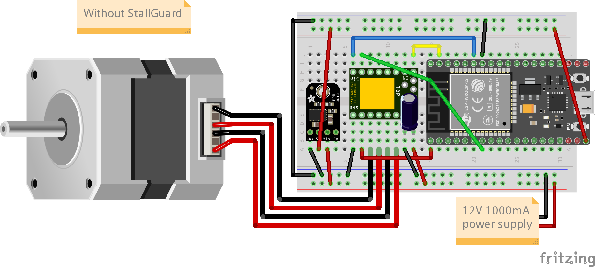

# ESP32 Motorcover
A ESP32-based DIY motorcover solution for smarthomes. A [**cover**](https://www.home-assistant.io/integrations/cover/)
is a rollershutter, blind, shade, window, etc. in [**Home Assistant**](https://www.home-assistant.io/). A motorized
cover provides the ability to control your covers via your choice of smarthome hub/system (Alexa, HA, etc.). Currently,
the ESP32 motorcover interfaces via WiFi/MQTT.

I've seen DIY motorized roller shade/blinds or motorized tilting control for venetian blinds around but not DIY
motorized honeycomb cellular shade. Commercial available motorized honeycomb cellular shades starts around $300-$400
per unit but the quality in terms of the speed, noise level, build material, and user expreience is below average.
So I have decided to retrofit a motor in my cordless honeycomb shades.

## Parts List
The exact parts I used to make 5 motorized shades. It was ~$92 per motorcovers but if you own a 3D printer, some
wires and screws, it will cost you ~$80 per unit.

|Name                         |Cost (incl. tax)|Shipping|Subtotal|Links  |
|-----------------------------|---------------:|-------:|-------:|:-----:|
|NEMA 11 bipolar stepper motor|          $33.34|  $33.12| $199.82|[[Stepperonline]](https://www.omc-stepperonline.com/nema-11-stepper-motor-bipolar-l-45mm-w-gear-ratio-5-1-planetary-gearbox-11hs18-0674s-pg5)|
|ESP32 node mcu               |          $12.10|        |  $60.50|[[Amazon]](https://www.amazon.com/dp/B0718T232Z)|
|Buck convertor               |           $5.95|   $7.99|  $37.74|[[Mouser]](https://www.mouser.com/ProductDetail/485-4739)|
|TMC2209 UART stepper driver  |          $34.12|        |  $34.12|[[Amazon]](https://www.amazon.com/gp/product/B07YW7BM68)|
|Coupling                     |          $14.96|        |  $14.96|[[Amazon]](https://www.amazon.com/gp/product/B07MPFJGZW)|
|100uF capacitor              |           $6.82|        |   $6.82|[[Amazon]](https://www.amazon.com/gp/product/B07Y3F194W)|
|Solderless breadboard        |           $6.59|        |   $6.59|[[Amazon]](https://www.amazon.com/gp/product/B07LF71ZTS)|
|Power supply                 |          $17.51|        |  $35.02|[[Amazon]](https://www.amazon.com/gp/product/B07N18XN84)|
|Wires                        |          $14.86|        |  $14.86|[[Amazon]](https://www.amazon.com/gp/product/B07Z4W6V6R)|
|Mounting bracket (Shapeways) |          $30.21|   $9.99|  $40.20|[[File]](resources/mounting_bracket_v3.stl)[[Mirrored File]](resources/mounting_bracket_v3_mirrored.stl)|
|Screws                       |          $10.00|        |     $10|       |
|Total                        |                |        | $460.63|       |

## Usage
### Connections

### Flashing firmware
#### Dependencies
You will need to add teemuatlut/TMCStepper@^0.7.3, knolleary/PubSubClient@^2.8,	gin66/FastAccelStepper@^0.27.5 to your project.

### WiFi and MQTT
https://www.home-assistant.io/integrations/cover.mqtt/
MQTT commands
0~100 percentage of open position; 0 -> open, 100 -> close
-1 stop
-2 open
-3 close
-4 set min position
-5 set max position
-99 reboot system

### My use case
#### Spring dampening

## Resources
### TMC2209 Info
TMC2209 datasheet: https://www.trinamic.com/fileadmin/assets/Products/ICs_Documents/TMC2209_Datasheet_V103.pdf
BigTreeTech TMC2209 schematic: https://github.com/bigtreetech/BIGTREETECH-TMC2209-V1.2/blob/master/Schematic/TMC2209-V1.2.pdf
BigTreeTech TMC2209 manual: https://github.com/bigtreetech/BIGTREETECH-TMC2209-V1.2/blob/master/manual/TMC2209-V1.2-manual.pdf
How to connect TMC2209 for UART (stallguard): https://forum.arduino.cc/t/using-a-tmc2209-silent-stepper-motor-driver-with-an-arduino/666992/14
Explaning TMC2209 settings: https://forum.arduino.cc/t/using-a-tmc2209-silent-stepper-motor-driver-with-an-arduino/666992/25

More explanation on Stallguard: https://gist.github.com/metalinspired/dcfe07ed0b9f42870eb54dcf8e29c126

How to connect UART for stallguard: https://forum.arduino.cc/t/tmcstepper-arduino-tmc2209/956036/9

ESP-now scanning devices: https://circuitcellar.com/research-design-hub/design-solutions/using-esp-now-protocol-part-1/
