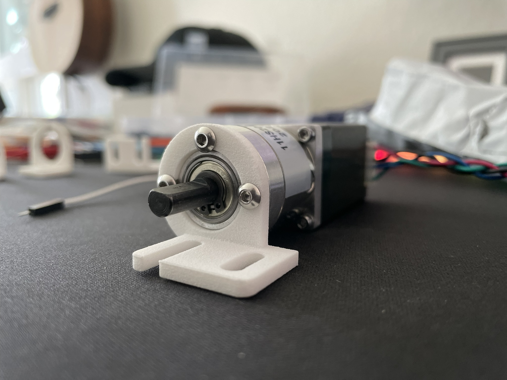
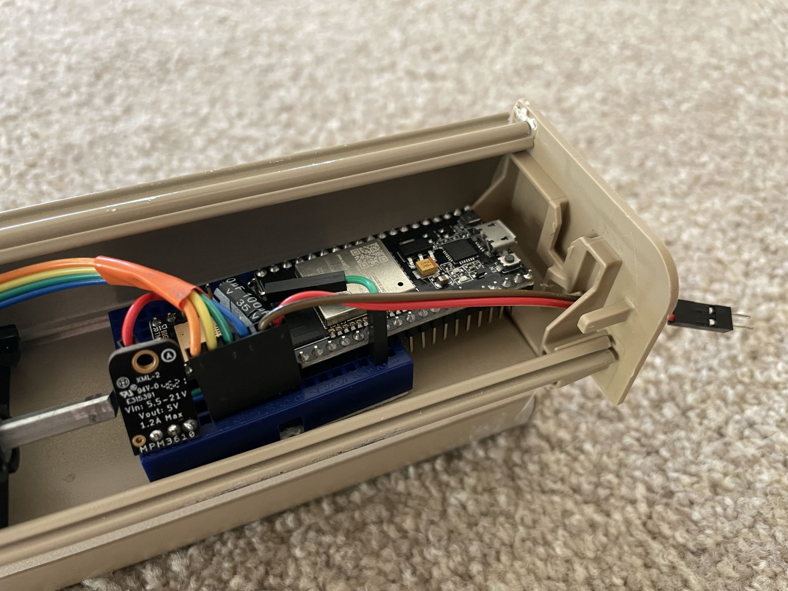

# ESP32 Motorcover
An open-source and DIY-friendly solution to motorize windows/blinds for your smart homes.

ESP32 motorcover is an affordable, reliable, and user-friendly closed-loop wireless stepper motor controller that works with NEMA stepper motors and other bipolar stepper motors.

Under active development.

## Designs
In [**Home Assistant**](https://www.home-assistant.io/), a [**cover**](https://www.home-assistant.io/integrations/cover/) is a type of entity that could be a blind, shade, shutter, window, garage door, etc. A motorized cover provides the ability to control your covers through your choice of smarthome hub/system (HA, Google Home, Alexa, etc.) through iOS/Android apps, voice control, or automations. Please see the [[**Demo video**](https://user-images.githubusercontent.com/52260129/211658800-c67d9bb7-6f65-4ab0-a19c-eaa4f9b99e2e.mp4)] for example.

### **Features:**
* Works with WiFi, no need for extra hub
* Closed-loop system, making the motor movements extremely precise and repeatable
* Automatic stalling detection and stopping, preventing injuries and protecting the motor
* Extremely quiet, won't even wake a baby!
* Few parts, cheap and easy to assemble

## Usage
There are three main components to consider: electronics, firmware, and motor + mounting hardware.

**Requirements:**
* Computer and [USB-to-TTL serial adatper](https://github.com/ilovehotcakes/ESP32-Motorcover/blob/pcb-v1.0/electronics/v1_1/BOM_ESP32-Motorcover_2024-03-27.csv) to upload the firmware
* Soldering iron
* Wires and JST PH connectors/crimper
* (Optional) 3D printer for the motor mount and coupling

### Electronics
There are two ways to build your own: **(1)** directly order printed circuit boards from JLCPCB/PCBWay or **(2)** buying parts from Amazon and putting them together manually on a breadboard.

**Option 1 - ordering PCB from JLCPCB:**
1. Download the [[**gerber files**](https://github.com/ilovehotcakes/ESP32-Motorcover/blob/pcb-v1.0/electronics/v1_1/Gerber_ESP32-Motorcover_PCB_ESP32-Motorcover_2024-03-27.zip)] and [[**bom**](https://github.com/ilovehotcakes/ESP32-Motorcover/blob/pcb-v1.0/electronics/v1_1/BOM_ESP32-Motorcover_2024-03-27.csv)].
2. Go to [JLCPCB.com](https://jlcpcb.com/) and upload the gerber files. The only setting that needs to be changed is the **Impedance Control**. Select **Yes** and choose **JLC0416H-3313** once the dialog pops up.
3. If you prefer to manually assemble the PCB, please refer to the [[**schematic**](https://github.com/ilovehotcakes/ESP32-Motorcover/blob/pcb-v1.0/electronics/v1_1/Schematic_ESP32-Motorcover_2024-03-27.png)] and bom.
4. If you prefer to have the PCB assembled by JLCPCB(additional cost), download the [[**pick-and-place file**](https://github.com/ilovehotcakes/ESP32-Motorcover/blob/pcb-v1.0/electronics/v1_1/PickAndPlace_PCB_ESP32-Motorcover_2024-03-27.csv)] and then toggle **PCB Assembly**. Click on **Confirm** to go the next page.
5. Upload the bom and pick-and-place files. Click **Process BOM & CPL** and **Continue** when the error pops up. The error is for the missing connectors which we will manually solder once we receive the pcbs.

    
    

**Option 2 - breakout boards and breadboarding:** 
This could be more approachable if you don't solder. Please find the list of materials [here](https://github.com/ilovehotcakes/ESP32-Motorcover/blob/pcb-v1.0/electronics/prototype/bom.csv) and reference the schematic to put the circuit together. An example assembly looks like [this](https://github.com/ilovehotcakes/ESP32-Motorcover/blob/pcb-v1.0/images/electronics/prototype/assembled_controller.jpg)

### Motor and mounting hardware
3D printer.

### 1. Hardware Connections
You can use this without StallGuard4. SG is a TMC2209 feature that enables the stepper motor to stop in an instance
when encountering a resistance. SG is convenient for setting the minimum position for the shades, i.e. sensorless
homing. It is also useful for protecting pets/children in the case of motorized windows. You don't need to connect
**DIAG_PIN** and **TXD2** if you don't planning on using SG.

### 2. Flashing Firmware
#### Dependencies
* espressif32@3.5.0
* [TMCStepper@^0.7.3](https://github.com/teemuatlut/TMCStepper)
* [PubSubClient@^2.8](https://github.com/knolleary/pubsubclient)
* [FastAccelStepper@^0.27.5](https://github.com/gin66/FastAccelStepper)
* [robtillaart/AS5600@^0.4.1](https://github.com/RobTillaart/AS5600)
* Your choice of development platform. I'm using VSCode + PlatformIO. For smart home hub, I'm using Home Assistant with MQTT integration.

#### Adding WiFi/MQTT Credentials and Setting Motor Specs
Clone this repo and follow the instructions in [motor_settings.h](include/motor_settings.h) and [secrets_example.h](include/secret_example.h). Flash the firmware to the ESP32 via your choice of IDE. It is handy to have the motor specifications for this part.

### 3. Sending Commands via MQTT
You will need a MQTT server/broker. You can run one on rpi4 or a docker.
* inTopic is where the motorcover will receive MQTT commands. For example, I set "/server/shades/1" on the MQTT server to send commands to the motorshade.
* outTopic is where motorcover will send MQTT messages to update its state. For example, I set "/client/shades/1" on the MQTT server to receive messages from the motorshade.
* Home Assistant provides an integration for [MQTT covers](https://www.home-assistant.io/integrations/cover.mqtt/)
* **MQTT Commands:**
    * **0~100: move to position(%);** 0 -> open, 100 -> close
    *  **-1  : stop**
    *  **-2  : open**
    *  **-3  : close**
    *  **-4  : set min position**
    *  **-5  : set max position**
    *  **-99 : reboot system**

### 4. Tuning StallGuard4 (Optional)
If you decided to use SG, you will need some patience to tune it to be useable. Here are the steps:
* Set the minimum RMS current required to move your cover.
* Set acceleration together with voltage. The acceleration needs to be low enough to not trip SG when the motor starts
moving. Sometimes the voltage is not high enough to accelerate the motor to max speed and trips SG. I had to use 12V
to make sure the motor accelerates up to max speed.
* Adjust the sensitivity of SG by changing sgThreshold.

## Sample Use Case - Honeycomb Cellular Shades
### Spring Dampening
With cordless honeycomb cellular shades, there are a couple of different designs for the cordless mechanism. Mine is an
older simpler design, which just contains an axle driving 2-3 spools to lift the shade via an internal cord. It has a
tape-like spring connected to the axle to prevents the shade from dropping when it is retracted. I would advise to keep
it to prevent the shade from falling by itself when the motor's holding current is cut.

With the spring, I've discovered that the shade will "overshoot" when opening if the shade is too light because the
spring is pulling in the same direction as the motor and causing a bouncing effect when the motor is stopped. One way
to fix this issue is by adding weights at the bottom of the shade so it dampens the bouncing effect. My shades all come
with 2 metal rods and weights each at the bottom. I took out the weights so the motor requires less torque to lift the
shades. If your motor is powerful enough to lift the cover without reducing the weight, leave it as-is; if your cover
overshoots when retracting, add some weights.

### Sound/Vibration Dampening
I have an old mousepad laying around so I cut it into small pieces and placed it underneath the stepper motor mounting
bracket to reduce the vibration and provide a bit of sound dampening. Most of noise comes from the spring retracting
and the bearings of the stepper motor, which is unavoidable. Also, the slower the speed is, the quieter the motorshade
is.

### Installation
Here are some photos of the assembled controller using all off-the-shelf components. The 3D file for the mounting bracket can be found under the resource folder.

## Resources
### TMC2209 Info
* [Trinamic TMC2209 datasheet](https://www.trinamic.com/fileadmin/assets/Products/ICs_Documents/TMC2209_Datasheet_V103.pdf)
* [BigTreeTech TMC2209 V1.2 schematic](https://github.com/bigtreetech/BIGTREETECH-TMC2209-V1.2/blob/master/Schematic/TMC2209-V1.2.pdf)
* [BigTreeTech TMC2209 V1.2 manual](https://github.com/bigtreetech/BIGTREETECH-TMC2209-V1.2/blob/master/manual/TMC2209-V1.2-manual.pdf)
### StallGuard Info
* [How to connect TMC2209 for UART (StallGuard)](https://forum.arduino.cc/t/using-a-tmc2209-silent-stepper-motor-driver-with-an-arduino/666992/14)
* [How to connect TMC2209 for UART (StallGuard) 2](https://forum.arduino.cc/t/tmcstepper-arduino-tmc2209/956036/9)
* [StallGuard example code](https://gist.github.com/metalinspired/dcfe07ed0b9f42870eb54dcf8e29c126)
### ESP-now (future feature)
* [ESP-now scanning devices](https://circuitcellar.com/research-design-hub/design-solutions/using-esp-now-protocol-part-1/)
